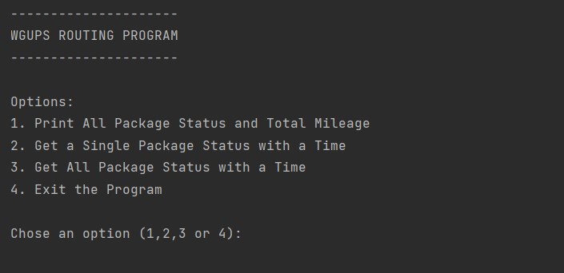
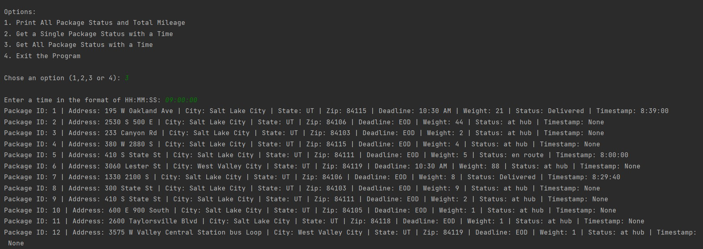
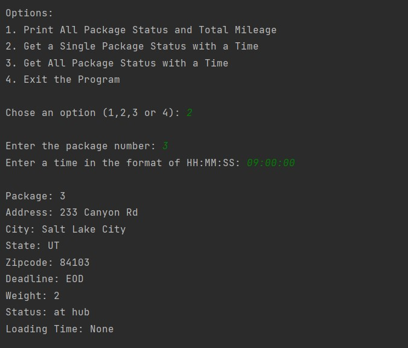

# C950

The purpose of this application is to deliver a series of packages using an efficent method travel in regards to distance traveled. Per the requirements of the project, an efficent route would be less than 140 miles, when starting from a time no earlier than 08:00:00. 

## Example of Usage
The UI implemented is a command line interface. Below is the first series of commands shown to the user when running the application.

If the user selects the first option, they will be shown all package information after all have been delivered and the total milage traveled.

When the user selects the second option, they will have to enter in a package id number and the time they would like to check the status for. Then they will be presented with the package details as of that time for the specified package.

When the user selects option three, they will have to specify a time and the applcation will return a list of all packages with their details as of that time.

